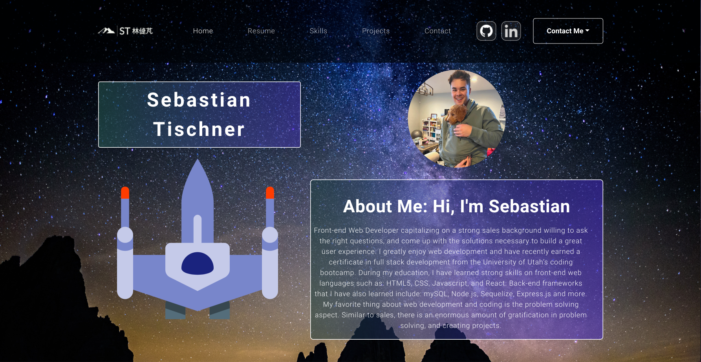

# React Portolio
  
  ## ReadMe Description 

  Hello, and thank you for taking a look at my portfolio build using react! On my portfolio you will be able to find info about me, projects that I have done, my resume, and skills I know. Feel free to reach out to me with any questions.  
  ## Table of Contents: 

  * [Installation](#installation) 

  * [Contributors](#contributors) 

  * [Usage](#usage) 

  * [Tests](#tests) 

  * [Questions](#questions) 

  * [License](#license) 

  ## Name: 

  Sebastian Tischner
  ## Installation 

  no installation
  ## Contributors 

  none
  ## Usage 

  run npm install to download node modules, and then run the command of npm start  
  ## Tests 

  none
  ## License 
 
  This project is protected by the MIT license.
  ## Questions 

  Github: [Sebascrab](https://github.com/Sebascrab) 

  Email: alexanders.tischner@outlook.com 

  

  

